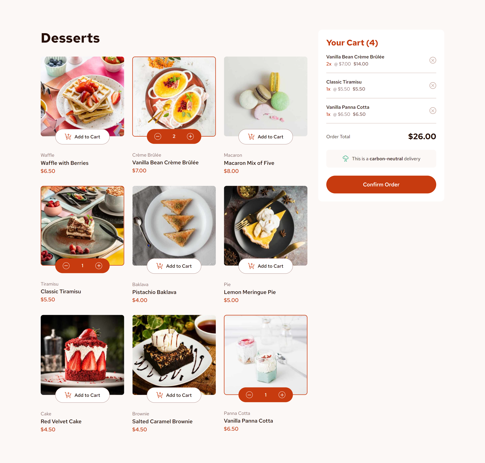
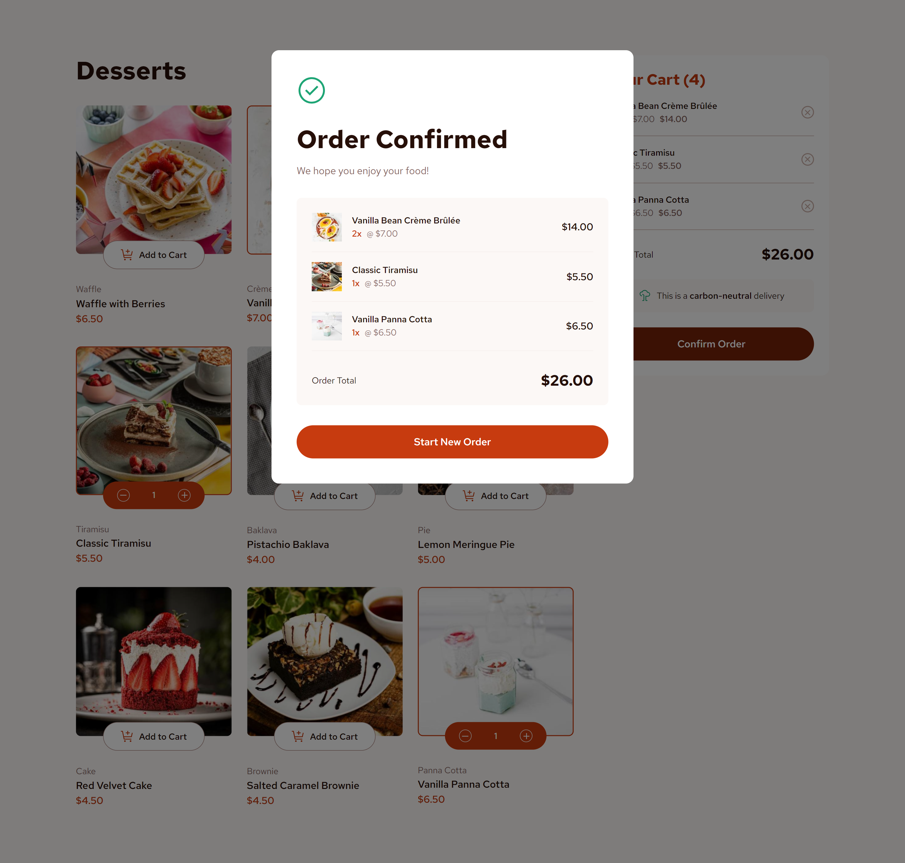
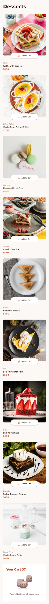

# Frontend Mentor - Product list with cart solution

This is a solution to the [Product list with cart challenge on Frontend Mentor](https://www.frontendmentor.io/challenges/product-list-with-cart-5MmqLVAp_d). Frontend Mentor challenges help you improve your coding skills by building realistic projects. 

## Table of contents

- [Overview](#overview)
  - [The challenge](#the-challenge)
  - [Screenshot](#screenshot)
  - [Links](#links)
- [My process](#my-process)
  - [Built with](#built-with)
  - [What I learned](#what-i-learned)
  - [Continued development](#continued-development)
- [Author](#author)

## Overview

### The challenge

Users should be able to:

- Add items to the cart and remove them
- Increase/decrease the number of items in the cart
- See an order confirmation modal when they click "Confirm Order"
- Reset their selections when they click "Start New Order"
- Navigate the whole project and perform all actions using only their keyboard
- View the optimal layout for the interface depending on their device's screen size
- See hover and focus states for all interactive elements on the page

### Screenshot

#### Desktop View

#### Mobile View

### Links

- Solution URL: [Github Repo](https://github.com/michellecordovi/ShopDessertsPage)
- Live Site URL: [Dessert Shop Live Site](https://shop-desserts.netlify.app/)

## My process

### Built with

- Semantic HTML5 markup
- CSS custom properties
- CSS Flexbox
- CSS Grid
- JavaScript
- React
- Vite

### What I learned

This was an extremely fun project to practice my React skills. Along with that, I learned a lot about creating a website that can be navigated via keyboard. This was a new challenge for me, but one I took on happily in an effort to better pracrtice my skills in web accessibility.

### Continued development

Again, this was the perfect project to not only practice my skills in React, but also a perfect introduction to creative a site that can be navigated via keyboard. I would like to take on more projects that allow me to continue to practice these skills.

## Author

- Website - [Michelle Cordovi LinkedIn](https://www.linkedin.com/in/michelle-cordovi-dpt/)
- Frontend Mentor - [@michellecordovi](https://www.frontendmentor.io/profile/michellecordovi)
